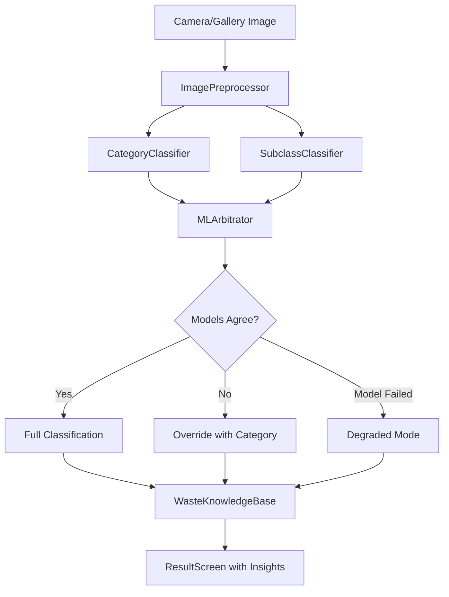

# Project Banner

<!-- Add a banner image here: docs/banner.png (1280x640 recommended) -->

<div align="center">

# WasegMul

### AI-Powered Waste Classification for a Sustainable Future

**Offline waste classification using TensorFlow Lite with real-time object detection**

[](https://github.com/manoj-ck2008/WasegMul/actions/workflows/android-ci.yml)
[](LICENSE)
[](https://kotlinlang.org)
[](https://www.tensorflow.org/lite)
[](https://developer.android.com/about/versions/10)
[](https://developer.android.com/jetpack/compose)

</div>

---

## Overview

WasegMul (Waste Segregation Multi-model AI) is an open-source Android application that uses deep learning to classify waste items into categories and specific material types, helping users make informed disposal decisions. The app runs entirely on-device using TensorFlow Lite, ensuring privacy and offline functionality.

**Key Capabilities:**
- Classify waste into 4 categories (E-Waste, Organic, Recyclable, Trash)
- Identify 30 specific material subclasses with disposal guidance
- Real-time object detection via YOLOv8n (under development)
- Environmental impact insights sourced from EPA and UN data

## Features

### Implemented

- **Offline Classification** - Works without internet using on-device TFLite models
- **Dual Model Architecture** - Separate EfficientNet models for category and subclass classification
- **Smart ML Arbitrator** - Resolves conflicts between models using Shannon entropy analysis
- **Degraded Mode** - Graceful fallback when one model fails
- **30 Material Classes** - Specific identification of waste materials from e-waste to organics
- **Environmental Insights** - Disposal guidance, impact data, and recycling recommendations
- **Real-time Detection** - YOLOv8n object detection with CameraX integration
- **Material Design 3** - Emerald dark theme with glassmorphism UI
- **Classification History** - Room database with feedback and correction system
- **Privacy-First** - No network calls, no data collection, all processing on-device
- **Kotlin Multiplatform** - Shared logic module for Android and iOS

### Under Development

- **YOLO Fine-tuning** - Custom YOLO model trained on TACO waste dataset
- **Multi-object Detection** - Detect multiple waste items simultaneously
- **Bounding Box Annotations** - Detailed object localization
- **Batch Classification** - Process multiple images at once

## Architecture

```
┌─────────────────────────────────────────────────────────┐
│                    Presentation Layer                     │
│  Jetpack Compose UI  ←→  ViewModels  ←→  Navigation     │
├─────────────────────────────────────────────────────────┤
│                      Domain Layer                        │
│  ModelManager  ←→  MLArbitrator  ←→  MessageGenerator   │
├─────────────────────────────────────────────────────────┤
│                       Data Layer                         │
│  Room DB  ←→  Repository  ←→  DataStore Preferences     │
├─────────────────────────────────────────────────────────┤
│                    ML Inference Layer                     │
│  CategoryClassifier  ←→  SubclassClassifier             │
│  YoloDetector  ←→  ImagePreprocessor                    │
├─────────────────────────────────────────────────────────┤
│               TensorFlow Lite (Play Services)            │
│  category_model.tflite  subclass_model.tflite           │
│  yolov8n.tflite                                         │
└─────────────────────────────────────────────────────────┘
```

### Classification Flow



## Tech Stack

| Component | Technology | Version |
|-----------|-----------|---------|
| Language | Kotlin | 2.1.0 |
| UI Framework | Jetpack Compose | BOM 2024.11.00 |
| Design System | Material Design 3 | Latest |
| ML Runtime | TensorFlow Lite | 2.17.0 |
| Object Detection | YOLOv8n | - |
| Image Processing | CameraX | 1.4.1 |
| Database | Room | 2.6.1 |
| Preferences | DataStore | 1.1.1 |
| Build System | Gradle | 8.11 |
| Android Gradle Plugin | AGP | 8.7.3 |
| Min SDK | Android 10 (API 29) | - |
| Target SDK | Android 15 (API 35) | - |

## Screenshots

> **Note:** Add screenshots to the `docs/screenshots/` directory and update paths below.

| Home | Classification | Result | YOLO Detection |
|------|---------------|--------|----------------|
|  |  |  |  |

## Installation

### Prerequisites

- Android Studio Ladybug (2024.2.1) or later
- JDK 21
- Android SDK 35
- Physical Android device (recommended) or emulator with camera

### From Source

```bash
# 1. Clone the repository
git clone https://github.com/manoj-ck2008/WasegMul.git
cd WasegMul

# 2. Open in Android Studio and let Gradle sync

# 3. Build the debug APK
./gradlew assembleDebug

# 4. Install on connected device
./gradlew installDebug
```

### From GitHub Releases

1. Go to [Releases](https://github.com/manoj-ck2008/WasegMul/releases)
2. Download the latest APK
3. Enable "Install unknown apps" on your device
4. Install the APK

## Model Information

### Category Classifier

- **Architecture:** EfficientNet-based (fine-tuned)
- **Input:** 224x224x3 (FLOAT32)
- **Output:** 4 classes
- **Classes:**
  - E-Waste
  - Organic
  - Recyclable
  - Trash
- **File:** `category_model_finetuned.tflite` (16.57 MB)

### Subclass Classifier

- **Architecture:** EfficientNet-based (fine-tuned)
- **Input:** 224x224x3 (FLOAT32)
- **Output:** 30 classes
- **File:** `subclass_model_finetuned.tflite` (16.59 MB)
- **Classes:** Air-Conditioner, Aluminum_Cans, Batteries, Cardboard, Clothing, Coffee_Grounds, Computer_Monitors, Copper_Wire, Disposable_Cutlery, Glass_Bottles, Keyboard, Laptop, LED_Light_Bulbs, Microwave, Mobile_Phone, Organic_Leaves, Paper, Paper_Cups, Plastic_Bags, Plastic_Bottles, Plastic_Cups, Plastic_Forks, Plastic_Straws, Plastic_Trash_Bags, Plastic_Wrappers, Printers, Refrigerator, Shoes, Styrofoam_Cups, Styrofoam_Food_Containers

### YOLO Detector

- **Architecture:** YOLOv8n
- **Input:** 640x640x3
- **Output:** 80 COCO classes
- **File:** `yolov8n.tflite` (12.25 MB)
- **Status:** Basic detection working, fine-tuning planned

### Limitations

- Classification accuracy depends on image quality and lighting
- YOLO detection uses COCO classes (not waste-specific) until fine-tuned
- Models are optimized for general waste; specialized industrial waste may require retraining
- Performance varies by device hardware

## Performance

- **Classification Speed:** ~200-500ms per image (varies by device)
- **YOLO Detection:** 15-30 FPS on mid-range devices
- **Memory Usage:** ~150MB during classification
- **Storage:** ~45MB for bundled TFLite models

## Project Structure

```
WasegMul/
├── app/                              # Main Android application
│   ├── src/main/
│   │   ├── assets/                   # TFLite models and class labels
│   │   ├── java/com/agrelius/wasegmul/
│   │   │   ├── data/                 # Room entities, DAOs, database
│   │   │   ├── ml/                   # ML pipeline (classifiers, detector)
│   │   │   ├── navigation/           # Compose navigation
│   │   │   ├── repository/           # Data repository
│   │   │   ├── ui/                   # Compose screens and components
│   │   │   └── utils/                # Settings, eco thoughts
│   │   └── res/                      # Android resources
│   └── proguard-rules.pro            # R8 minification rules
├── shared/                           # Kotlin Multiplatform shared module
│   └── src/commonMain/kotlin/        # Cross-platform domain logic
├── iosApp/                           # iOS application entry point
├── gradle/                           # Gradle wrapper and version catalog
├── scripts/                          # Build utility scripts
├── .github/workflows/                # CI/CD configuration
└── docs/                             # Documentation
```

## Roadmap

- [x] EfficientNet-based waste classification
- [x] 4-category classification
- [x] 30-subclass identification
- [x] ML arbitrator for model conflict resolution
- [x] YOLOv8n integration for object detection
- [x] Real-time camera detection with bounding boxes
- [x] Room database for classification history
- [x] Environmental impact insights
- [x] Material Design 3 dark theme
- [x] Kotlin Multiplatform shared module
- [ ] YOLO fine-tuning on TACO waste dataset
- [ ] Multi-object detection in single frame
- [ ] Batch image classification
- [ ] Unit test coverage for ML pipeline
- [ ] Detekt/ktlint code quality tools
- [ ] iOS app completion

## Contributing

Contributions are welcome! Please read our [Contributing Guidelines](CONTRIBUTING.md) first.

1. Fork the repository
2. Create a feature branch (`git checkout -b feature/amazing-feature`)
3. Commit changes (`git commit -m 'feat: add amazing feature'`)
4. Push to branch (`git push origin feature/amazing-feature`)
5. Open a Pull Request

## License

This project is licensed under the MIT License - see the [LICENSE](LICENSE) file for details.

## Acknowledgements

- [TensorFlow Lite](https://www.tensorflow.org/lite) - On-device ML inference
- [Jetpack Compose](https://developer.android.com/jetpack/compose) - Modern Android UI
- [CameraX](https://developer.android.com/media/camera/camerax) - Camera integration
- [YOLOv8](https://github.com/ultralytics/ultralytics) - Object detection architecture
- [TACO Dataset](http://tacodataset.org/) - Trash Annotation in Context
- [EPA](https://www.epa.gov/) - Environmental impact data
- [Room](https://developer.android.com/training/data-storage/room) - Local database

## Author

**Manoj** - [GitHub](https://github.com/manoj-ck2008)

---

<div align="center">

Made with care for a cleaner planet

</div>
