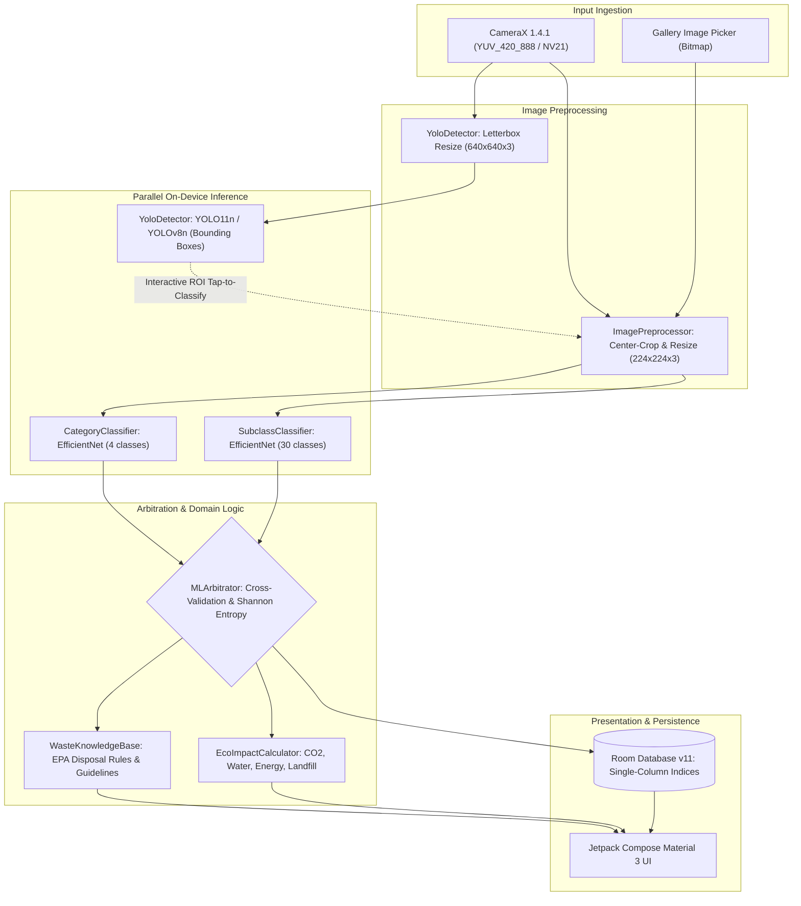
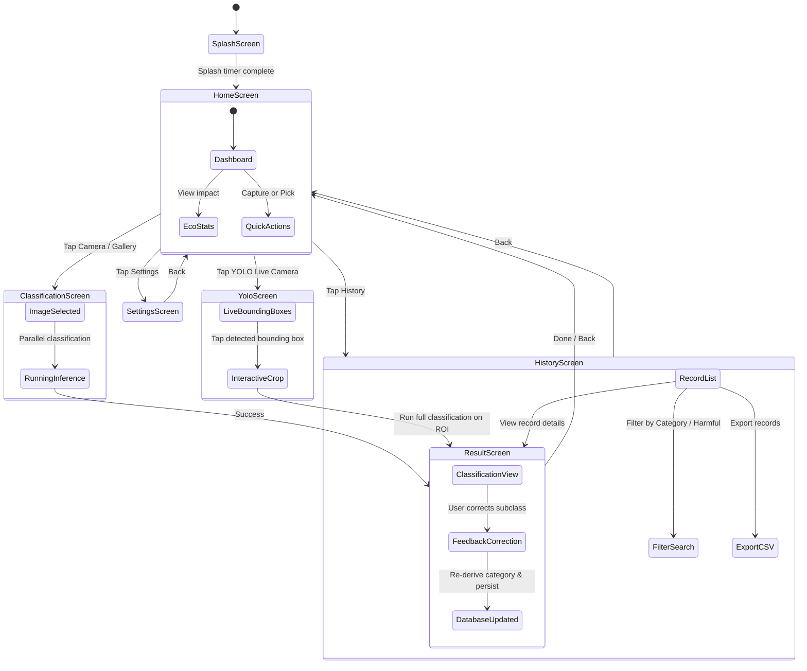

<p align="center">
  
</p>

<h1 align="center">WasegMul</h1>

<p align="center">
  <strong>Waste Segregation with Multi-Model AI</strong>
</p>

<p align="center">
  <a href="https://github.com/manoj-ck2008/WasegMul/blob/main/LICENSE">
    
  </a>
  
  
  
  
  
   
</p>

<p align="center">
  An on-device waste classification and real-time detection Android application powered by TensorFlow Lite and multi-model AI arbitration. Point your camera at any waste item to instantly identify its category, subclass, and actionable disposal guidance, completely offline with zero data leaving your device.
</p>

---

## Overview

WasegMul (**Wa**ste **Seg**regation **Mul**ti-model) is a Kotlin Multiplatform and Jetpack Compose Android application that pairs two fine-tuned EfficientNet neural networks with real-time YOLO object detection. The app classifies items into 4 canonical categories and 30 subclasses, cross-checks predictions using Shannon entropy arbitration, computes verifiable ecological impact metrics, and provides actionable disposal guidance sourced from EPA and recycling authority standards.

**Key design principle**: All inference runs 100% on-device. No images, telemetry, or user records are transmitted to any server, guaranteeing privacy by design.

---

## Pipeline & Architecture

### Multi-Model Inference & Arbitration Pipeline



---

## Features

### Implemented

- **On-Device Waste Classification**: Dual EfficientNet neural networks classify items into 4 categories and 30 subclasses in milliseconds per model on modern devices (reference figures in Model Specifications — device-dependent, not a guarantee).
- **Zero-Allocation Tensor Pipelines**: Reusable preallocated direct native `ByteBuffer` instances eliminate GC churn during continuous camera streaming.
- **YOLO Real-Time Object Detection**: Live CameraX object detection with bounding boxes, labels, interactive tap-to-classify ROI cropping, per-detection disposal guidance cards, and temporal smoothing (600 ms hold, confidence hysteresis, shake deadband) for stable tracking.
- **Multi-Model ML Arbitrator**: Cross-validates category and subclass predictions, detects conflicts, and quantifies uncertainty using Shannon entropy.
- **Actionable Disposal Guidance**: EPA-aligned disposal instructions, environmental hazards, and preparation steps across all 30 subclasses.
- **Eco Impact Dashboard**: Tracks cumulative diverted landfill waste, avoided CO2 emissions, conserved water, and saved energy.
- **Planet Hero Celebration**: Every classification opens an appreciative full-screen moment — eco badge, XP award, CO2/water impact pills, and a "View Analysis Report" action.
- **Gamification & Levels**: Level badge, level title, XP progress to the next level, and daily streaks, with barcode scans earning XP at parity with camera scans and same-item spam earning nothing.
- **Deep Linking**: `wasegmul://barcode` opens the scanner cold or warm (singleTask-safe `onNewIntent` forwarding + manifest intent-filter).
- **Room Database v11**: Schema with single-column indices on `waste_history(timestamp, category, subclass, feedback)`, a `barcode_products` cache table (v9→v10), and barcode provenance columns on `waste_history` (v10→v11) for high-performance querying.
- **Data Integrity & Consistency**: Re-derives canonical category automatically upon user feedback correction.
- **Material Design 3 & Expressive UI**: Glassmorphism cards with Android 12+ RenderEffect frosted blur, animated organic backgrounds, and falling petals.
- **Dynamic Color & Themes**: Full support for Android 12+ dynamic color matching, Emerald Neon dark mode, Light mode, and Olive Nature theme.
- **CSV Export & Sharing**: Background coroutine streaming export of historical waste records with file-sharing intents.
- **Cross-Platform KMP Core**: Clean separation of domain logic (`MLArbitrator`, `EcoImpactCalculator`, `PredictionCodec`, `MessageGenerator`) ready for iOS via Kotlin Multiplatform.
- **100% Offline & Private**: Zero network dependencies for core features; all data remains local.

---

## Tech Stack

| Layer | Technology | Version | Purpose |
|---|---|---|---|
| **Language** | Kotlin | 2.1.0 | Shared multiplatform code and Android app |
| **UI Framework** | Jetpack Compose | BOM 2024.11.00 | Declarative UI with Material 3 expressive styling |
| **ML Engine** | TensorFlow Lite | 2.17.0 | Bundled on-device C++ inference runtime |
| **Object Detection** | YOLO11n / YOLOv8n | Ultralytics | Real-time live bounding box detection and ROI extraction |
| **Camera** | CameraX | 1.4.1 | Hardware camera binding, lifecycle control, analysis stream |
| **Persistence** | Room SQLite | 2.6.1 | Local storage with composite indices and Room schema export |
| **Preferences** | Jetpack DataStore | 1.1.1 | Reactive type-safe theme preferences |
| **Navigation** | Navigation Compose | 2.8.5 | Single-activity screen routing and deep linking |
| **Build Tool** | Gradle | 8.11 | Modern build system with Version Catalog (`libs.versions.toml`) |
| **Target Runtime** | Android SDK | Min API 29, Target API 35 | Modern Android lifecycle and hardware features |

---

## Application Navigation Flow



---

## Model Specifications

### 1. Category Classifier

| Property | Value |
|---|---|
| **Model Architecture** | EfficientNet-B0 (Fine-tuned) |
| **Input Dimensions** | 224 x 224 x 3 RGB Float32, raw [0,255] (no NormalizeOp — matches the `ImagePreprocessor` normalization contract; training preprocessing must use the same scale) |
| **Output Shape** | `[1, 4]` (Probability distribution via Softmax) |
| **Classes** | `E-Waste`, `Organic`, `Recyclable`, `Trash` |
| **Latency** | ~25 ms reference figure (Pixel-class device, CPU / XNNPACK — device-dependent, not a guarantee) |

### 2. Subclass Classifier

| Property | Value |
|---|---|
| **Model Architecture** | EfficientNet-B0 (Fine-tuned) |
| **Input Dimensions** | 224 x 224 x 3 RGB Float32, raw [0,255] (no NormalizeOp — matches the `ImagePreprocessor` normalization contract; training preprocessing must use the same scale) |
| **Output Shape** | `[1, 30]` (Probability distribution via Softmax) |
| **Classes (30)** | `Air-Conditioner`, `Battery`, `Cardboard`, `Electronic Component`, `Electronic Device`, `Glass`, `Keyboard`, `Laptop`, `Metal`, `Microwave`, `Miscellaneous Trash`, `Mobile`, `Mouse`, `Organic`, `PCB`, `Paper`, `Plastic`, `Player`, `Printer`, `Refrigerator`, `Television`, `Textile Trash`, `Washing Machine`, `automobile wastes`, `clothing`, `disposable_plastic_cutlery`, `light bulbs`, `shoes`, `styrofoam_cups`, `styrofoam_food_containers` |
| **Latency** | ~35 ms reference figure (Pixel-class device, CPU / XNNPACK — device-dependent, not a guarantee) |

### 3. YOLO Object Detector

| Property | Value |
|---|---|
| **Model Architecture** | YOLO11n (Ultralytics) / YOLOv8n fallback |
| **Input Dimensions** | 640 x 640 x 3 RGB Normalized Float32 (Letterbox preservation) |
| **Output Shape** | `[1, 19, 8400]` (4 box coordinates + 15 waste classes) or `[1, 84, 8400]` (COCO) |
| **NMS Post-Processing** | IoU threshold = 0.45, Confidence threshold = 0.45 (see `YoloDetector` `IOU_THRESHOLD` / `CONFIDENCE_THRESHOLD`) |
| **Feature** | Real-time bounding boxes with tap-to-focus ROI crop and classification |

---

## Test Verification Matrix

All test suites execute against the Kotlin Multiplatform shared library and Android application modules — 23 app suites (162 tests) + 13 shared suites (100 tests):

| Test Suite | File Path | Test Cases | Seam / Coverage |
|---|---|---|---|
| **EcoImpactTest** | `app/src/test/.../EcoImpactTest.kt` | 9 tests | Diversion multipliers, hazardous credit, zero bounds, credited-counts |
| **MLArbitratorTest** | `app/src/test/.../MLArbitratorTest.kt` | 14 tests | Full agreement, partial agreement, degradation fallbacks, entropy spikes |
| **ModelBenchmarkTest** | `app/src/test/.../ModelBenchmarkTest.kt` | 20 tests | Taxonomy counts, IoU contract, prod entropy/softmax/range-guard, CSV sanitize, pinned timeouts, codec round-trip |
| **PredictionCodecTest** | `app/src/test/.../PredictionCodecTest.kt` | 7 tests | Base64 and Hex serialization/deserialization, float precision, boundary cases |
| **MessageGeneratorTest** | `app/src/test/.../MessageGeneratorTest.kt` | 10 tests | 8 operational classification modes, fallback safety messages |
| **WasteKnowledgeBaseTest**| `app/src/test/.../WasteKnowledgeBaseTest.kt` | 5 tests | 30 subclass rules, hazard flags, missing entry fallbacks |
| **WasteMappingTest** | `app/src/test/.../WasteMappingTest.kt` | 7 tests | Subclass-to-category taxonomy integrity, case insensitivity |
| **MappersTest** | `app/src/test/.../MappersTest.kt` | 4 tests | Domain model to Room entity bidirectional mapping, null safety |
| **WasteRepositoryTest** | `app/src/test/.../WasteRepositoryTest.kt` | 10 tests | Repository data-access seams |
| **BarcodeScannerTest** | `app/src/test/.../ml/BarcodeScannerTest.kt` | 8 tests | EAN-13 checksum fixtures, GTIN URL parsing, junk rejection, lifecycle |
| **BarcodeRepositoryTest** | `app/src/test/.../repository/BarcodeRepositoryTest.kt` | 7 tests | Barcode resolution seams |
| **BarcodeDisplayTest** | `app/src/test/.../ui/BarcodeDisplayTest.kt` | 8 tests | Barcode display parsing, CSV cell sanitize |
| **GamificationManagerTest** | `app/src/test/.../gamification/GamificationManagerTest.kt` | 10 tests | XP/state computation seams |
| **DisposalDatabaseTest** | `app/src/test/.../data/disposal/DisposalDatabaseTest.kt` | 8 tests | Disposal data loading/filtering seams |
| **ImagePreprocessorRangeTest** | `app/src/test/.../ml/ImagePreprocessorRangeTest.kt` | 2 tests | Raw-[0,255] preprocessing contract pin |
| **NotificationHelperTest** | `app/src/test/.../notification/NotificationHelperTest.kt` | 1 test | Level-up notification builder seam |
| **BarcodeSanitizeTest** | `app/src/test/.../repository/BarcodeSanitizeTest.kt` | 7 tests | Barcode junk gate, GS1 extract, UPC-A pad |
| **ClassificationDownscaleTest** | `app/src/test/.../ui/classify/ClassificationDownscaleTest.kt` | 4 tests | 1024 long-edge handoff bound (OOM guard) |
| **HistoryGroupingTest** | `app/src/test/.../ui/history/HistoryGroupingTest.kt` | 4 tests | History grouping seams |
| **CelebrationGlowTest** | `app/src/test/.../ui/result/CelebrationGlowTest.kt` | 4 tests | RadialGradient zero-radius crash regression |
| **DetectionSmootherTest** | `app/src/test/.../ui/yolo/DetectionSmootherTest.kt` | 6 tests | Track matching, hold, hysteresis, deadband |
| **YoloGuidanceTest** | `app/src/test/.../ui/yolo/YoloGuidanceTest.kt` | 5 tests | Per-detection disposal guidance mapping |
| **YoloViewModelTest** | `app/src/test/.../ui/yolo/YoloViewModelTest.kt` | 2 tests | YOLO ViewModel seams |
| **Shared commonTest** | `shared/src/commonTest/...` (13 suites) | 100 tests | CommonModels, DecayTime, EcoImpact, IOSBridge, MessageGenerator, MLArbitrator (+barcode), network GTIN/lenient-JSON, PackagingWasteMapper, PredictionCodec, WasteKnowledgeBase, WasteMapping |

Execute the complete test suite locally:

```bash
./gradlew testDebugUnitTest
```

---

## Repository Structure

```
WasegMul/
├── .github/
│   └── workflows/
│       └── android-ci.yml          # GitHub Actions CI matrix (JDK 21, Gradle 8.11)
├── app/
│   ├── schemas/                    # Room exported JSON schemas for schema migrations
│   │   └── com.agrelius.wasegmul.data.WasteDatabase/
│   │       ├── 8.json              # Version 8 schema
│   │       ├── 9.json              # Version 9 schema with category/subclass/feedback indices
│   │       ├── 10.json             # Version 10 schema with barcode_products cache table
│   │       └── 11.json             # Version 11 schema with barcode provenance columns
│   ├── src/
│   │   ├── main/
│   │   │   ├── assets/             # Bundled TFLite models and label dictionaries
│   │   │   │   ├── category_model_finetuned.tflite
│   │   │   │   ├── category_classes.txt
│   │   │   │   ├── subclass_model_finetuned.tflite
│   │   │   │   ├── subclass_classes.txt
│   │   │   │   └── yolov8n.tflite
│   │   │   ├── java/com/agrelius/wasegmul/
│   │   │   │   ├── data/           # Room entities, DAOs, and database migrations (MIGRATION_6_7 through MIGRATION_10_11)
│   │   │   │   ├── ml/             # ModelManager, YoloDetector, TfliteClassifier, Preprocessors
│   │   │   │   │   ├── classifiers/
│   │   │   │   │   │   ├── CategoryClassifier.kt
│   │   │   │   │   │   ├── SubclassClassifier.kt
│   │   │   │   │   │   └── TfliteClassifier.kt
│   │   │   │   │   └── preprocessing/
│   │   │   │   │       └── ImagePreprocessor.kt
│   │   │   │   ├── navigation/     # Jetpack Compose screen routes and NavGraph
│   │   │   │   ├── repository/     # WasteRepository data access layer
│   │   │   │   ├── ui/             # Jetpack Compose presentation layer
│   │   │   │   │   ├── components/ # GlassCard, FallingPetals, OrganicBackground, HeroCard
│   │   │   │   │   ├── guide/      # Waste segregation reference guide screen
│   │   │   │   │   ├── history/    # Historical record browser with filtering and CSV export
│   │   │   │   │   ├── result/     # Classification outcome, entropy, and feedback screen
│   │   │   │   │   ├── settings/   # Theme selection, DataStore preferences, cache management
│   │   │   │   │   ├── splash/     # Splash screen with branded animations
│   │   │   │   │   ├── theme/      # Dynamic Color, emerald neon, light, and colour palettes
│   │   │   │   │   └── yolo/       # CameraX live detection with interactive ROI cropping
│   │   │   │   ├── utils/          # SettingsManager, CSVExporter, ShareHelper, EcoThoughts
│   │   │   │   └── viewmodel/      # HomeViewModel, ClassificationViewModel, HistoryViewModel
│   │   │   └── res/                # Vector drawables, strings, colors, mipmaps
│   │   └── test/                   # Unit test suites (14 app suites; 13 more in shared/commonTest)
│   ├── build.gradle.kts            # Android application build configuration
│   └── proguard-rules.pro          # TFLite, Room, and Coroutines R8 keep rules
├── shared/                         # Kotlin Multiplatform (KMP) shared module
│   ├── src/
│   │   ├── commonMain/kotlin/      # Platform-agnostic domain logic
│   │   │   └── com/agrelius/wasegmul/
│   │   │       ├── CommonModels.kt         # Shared records, classification outcomes, failure reasons
│   │   │       ├── EcoImpactCalculator.kt  # Landfill, carbon, water, and energy metrics
│   │   │       ├── IOSBridge.kt            # Swift-friendly interoperability layer
│   │   │       ├── MessageGenerator.kt     # 8 operational message modes
│   │   │       ├── MLArbitrator.kt         # Entropy-based arbitration engine
│   │   │       ├── PredictionCodec.kt      # Efficient hex/base64 tensor serialization
│   │   │       ├── WasteKnowledgeBase.kt   # EPA disposal knowledge base
│   │   │       └── WasteMapping.kt         # Canonical 30 subclass-to-category mappings
│   │   └── iosMain/kotlin/         # iOS target entry points
│   └── build.gradle.kts            # KMP multi-target configuration
├── iosApp/                         # iOS application shell consuming shared KMP framework
│   ├── iosApp/
│   │   ├── ContentView.swift       # SwiftUI interactive prototype
│   │   └── iosApp.swift            # iOS App entry point
│   └── README.md
├── scripts/                        # Python ML and dataset engineering pipeline
│   ├── export_waste_model_tflite.py # PyTorch/SavedModel to INT8/FP16 TFLite exporter
│   ├── export_yolo_tflite.py       # Ultralytics YOLO to TFLite exporter
│   ├── generate_taxonomy_md.py     # Taxonomy documentation generator
│   ├── kaggle_train.py             # Cloud training script for Kaggle GPU instances
│   ├── prepare_dataset.py          # TACO/TrashNet dataset normalization and YOLO splitter
│   ├── train_waste_yolo.py         # YOLO11n fine-tuning pipeline
│   └── waste_dataset.yaml          # YOLO dataset configuration
├── docs/                           # Exhaustive technical documentation
│   ├── architecture.md             # System architecture with 7 Mermaid diagrams
│   ├── developer-guide.md          # Complete engineering handbook
│   ├── training-guide.md           # ML model training and quantization guide
│   ├── taxonomy.md                 # Complete 30-class waste taxonomy
│   ├── FAQ.md                      # Frequently asked questions
│   └── ATTRIBUTION.md              # Open source attributions and dataset licenses
├── gradle/                         # Gradle wrapper and version catalog
│   └── libs.versions.toml          # Centralized dependency catalog
├── build.gradle.kts                # Root build file
├── settings.gradle.kts             # Included modules and plugin management
├── gradle.properties               # JVM flags, version codes, AndroidX properties
├── taxonomy.yaml                   # Single-source-of-truth taxonomy definition
├── datasets_manifest.yaml          # Dataset provenance manifest
├── CHANGELOG.md                    # Release history and milestone logs
├── CONTRIBUTING.md                 # Developer contribution guidelines
├── CODE_OF_CONDUCT.md              # Contributor Covenant Code of Conduct
├── SECURITY.md                     # Security vulnerability reporting policy
└── LICENSE                         # MIT License
```

---

## Installation & Setup

### Prerequisites

- **Android Studio**: Ladybug (2024.2.1) or later (Koala Feature Drop supported)
- **Java Development Kit (JDK)**: JDK 21 (LTS recommended and required by CI)
- **Android SDK**: API Level 35 (compileSdk 35, targetSdk 35, minSdk 29)
- **Physical Device or Emulator**: Android 10+ (API 29+) with camera support for CameraX and YOLO

### Build from Source

1. **Clone the repository**:
   ```bash
   git clone https://github.com/manoj-ck2008/WasegMul.git
   cd WasegMul
   ```

2. **Open in Android Studio**:
   - Select **File** -> **Open** -> Choose `WasegMul` root directory.
   - Allow Gradle sync to download dependencies and indexing to complete.

3. **Run Unit Tests**:
   ```bash
   ./gradlew testDebugUnitTest
   ```

4. **Assemble Debug APK**:
   ```bash
   ./gradlew assembleDebug
   ```

5. **Install on Device**:
   ```bash
   ./gradlew installDebug
   ```

### Release Build

Production builds use R8 code shrinking and resource optimization. Place your release signing keys in `keystore.properties` at the project root:

```properties
storeFile=/path/to/keystore.jks
storePassword=your_store_password
keyAlias=your_key_alias
keyPassword=your_key_password
```

Then invoke:
```bash
./gradlew assembleRelease
```

> **Keystore discipline**: `keystore.properties`, `*.jks`, and `*.keystore` are
> git-ignored (never commit them — a force-add would be a security incident).
> Prefer CI secrets / environment variables over a root-located file, `chmod 600`
> the file and key, and rotate credentials if they ever touch VCS, screenshots,
> or shared machines. Release builds fail closed without valid signing config
> (see `app/build.gradle.kts`).

### Versioning

The app version is single-sourced from `gradle.properties` (`VERSION_NAME=3.0.0`,
`VERSION_CODE=4`). The iOS shell's `kAppVersionString` (`ContentView.swift`) and
the shared `IOSBridge` surface must be bumped in the same commit — there is no
automatic cross-platform version propagation.

---

## Contributing

Contributions are welcome. Please read our [Contributing Guidelines](CONTRIBUTING.md) and adhere to the [Code of Conduct](CODE_OF_CONDUCT.md).

---

## License

This project is licensed under the MIT License - see the [LICENSE](LICENSE) file for details.

The bundled YOLO model weights and Ultralytics tooling are subject to AGPL-3.0 or Enterprise licensing. See [Ultralytics Licensing](https://www.ultralytics.com/license) for commercial applications.

---

## Author

**Manoj** - [GitHub Profile](https://github.com/manoj-ck2008)
