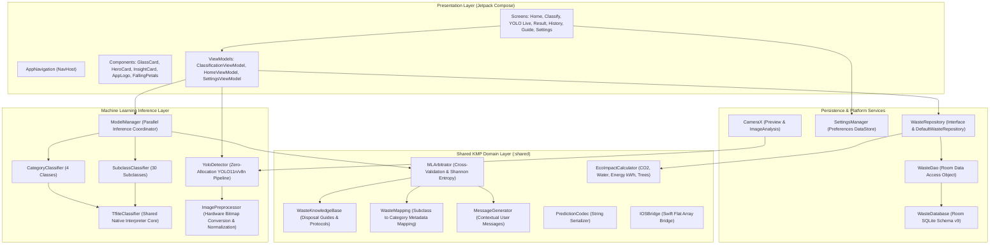
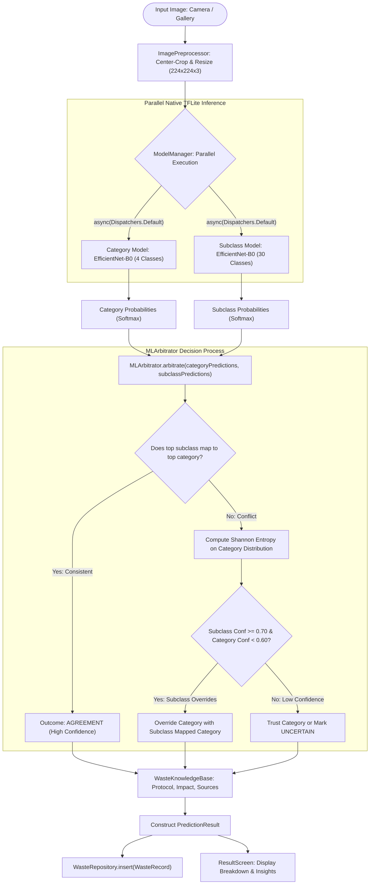
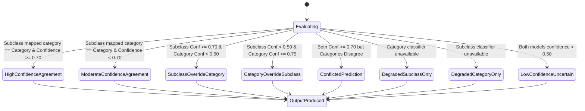
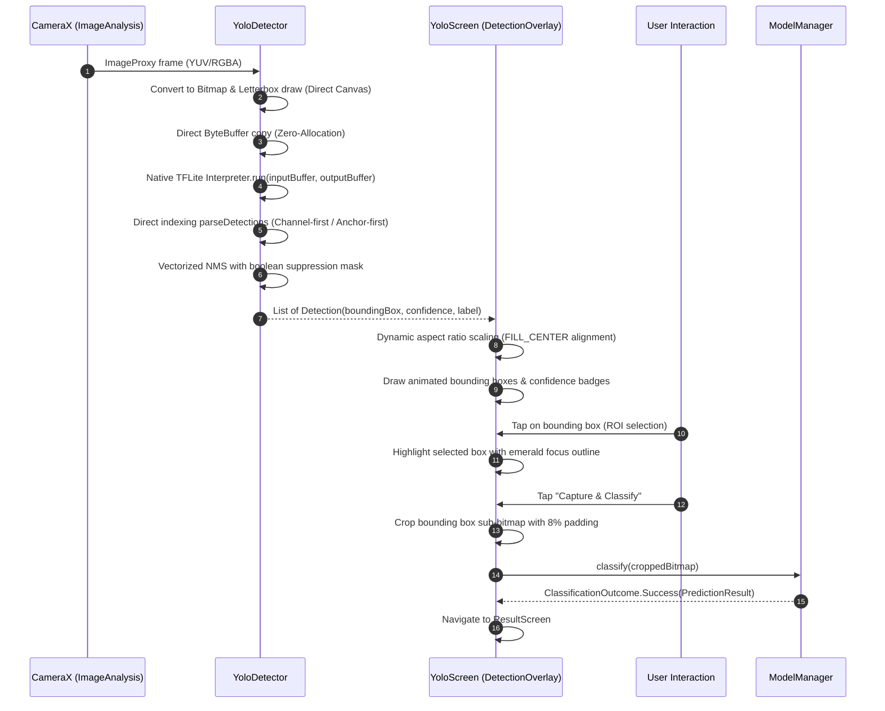
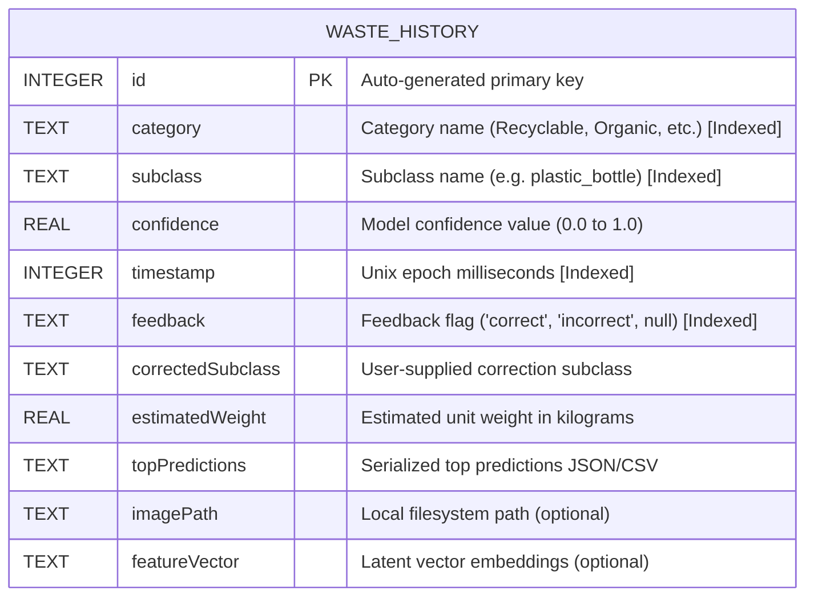
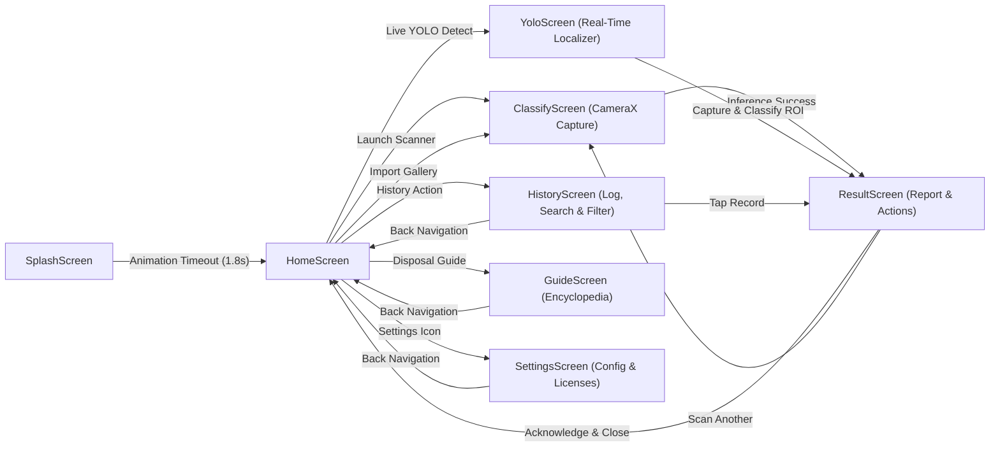
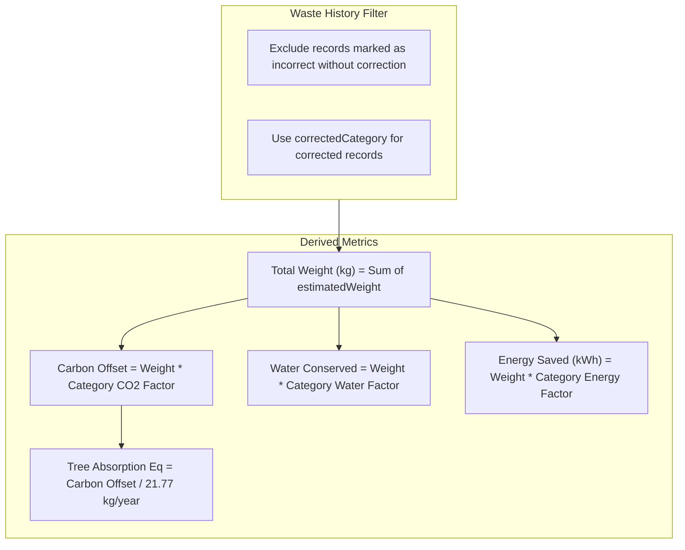
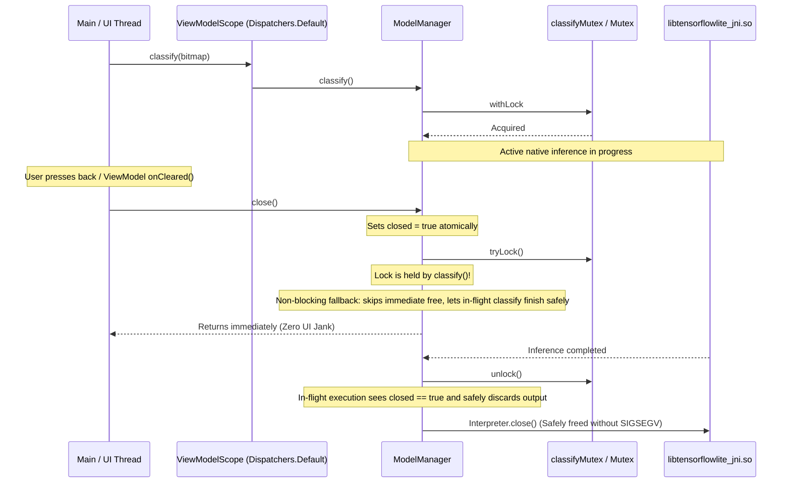

# WasegMul System Architecture & Technical Specification

This document provides a comprehensive architectural specification of the WasegMul (Waste Segregation Multi-model AI) platform, covering the multi-model machine learning pipeline, shared Kotlin Multiplatform (KMP) domain layer, Android UI/UX architecture, Room database schema, and thread synchronization guarantees.

---

## 1. High-Level System Architecture

WasegMul is structured into clean architectural layers following separation-of-concerns principles. The application core is divided between an Android-specific host (`app/`) and a platform-agnostic Kotlin Multiplatform library (`shared/`).



---

## 2. Multi-Model Inference & Arbitration Pipeline

The primary classification pipeline coordinates two specialized EfficientNet neural networks executing in parallel, combined through an analytical arbitration state machine.

### 2.1 Inference & Arbitration Flow



### 2.2 Shannon Entropy & Uncertainty Estimation

The arbitrator computes Shannon entropy across the category probability distribution \(P = \{p_1, p_2, \dots, p_N\}\) to measure model ambiguity:

$$H(P) = - \sum_{i=1}^{N} p_i \log_2(p_i)$$

- Normalized entropy: \(H_{\text{norm}} = \frac{H(P)}{\log_2(N)}\) where \(N = 4\) categories.
- When \(H_{\text{norm}} > 0.75\), the category classifier is categorized as confused.
- If the subclass model outputs a high-confidence match (confidence \(\ge 0.70\)) whose mapped category differs from the category model's confused output, the arbitrator trusts the subclass evidence and resolves the category conflict automatically.

### 2.3 Arbitration State Machine



---

## 3. Real-Time YOLO Detection Architecture

The YOLO pipeline operates asynchronously on the live CameraX video stream, performing real-time multi-object localization and interactive Region-of-Interest (ROI) classification.



### 3.1 Zero-Allocation Memory Design in `YoloDetector`

To prevent garbage collection pauses during 20-30 FPS camera analysis:
1. **Preallocated Buffers**: A single native direct `ByteBuffer` for model input (`1 * 640 * 640 * 3 * 4` bytes = 4.91 MB) and output (`1 * C * Anchors * 4` bytes) are allocated once at initialization.
2. **Zero-Allocation Transposition**: Rather than copying and transposing 2.8 MB multidimensional float arrays per frame, the detector uses mathematical index calculations:
   - Output layout detection determines stride dynamically: `outputArray[c * numAnchors + a]` vs `outputArray[a * numChannels + c]`.
3. **NMS Suppression Bitmask**: Non-maximum suppression uses a preallocated `BooleanArray(candidates.size)` to flag suppressed boxes in O(N) memory without allocating list mutations.

---

## 4. Data Layer & Room Database Schema

The persistence layer is implemented using Room SQLite, updated to schema version 9 with composite indices to guarantee instant queries across historical logs.

### 4.1 Database Entity-Relationship Diagram



### 4.2 Room Migration 8 to 9

Migration `MIGRATION_8_9` creates targeted performance indices on critical query columns:
```sql
CREATE INDEX IF NOT EXISTS index_waste_history_category ON waste_history (category);
CREATE INDEX IF NOT EXISTS index_waste_history_subclass ON waste_history (subclass);
CREATE INDEX IF NOT EXISTS index_waste_history_feedback ON waste_history (feedback);
CREATE INDEX IF NOT EXISTS index_waste_history_timestamp ON waste_history (timestamp);
```

---

## 5. UI Navigation Graph

The application follows single-activity architecture powered by Jetpack Navigation Compose.



---

## 6. Eco Impact Calculation Model

The `EcoImpactCalculator` derives cumulative environmental diversion statistics from confirmed and uncorrected records:



### Mathematical Multipliers

| Category | Carbon Offset (kg CO2e / kg) | Water Conserved (Litres / kg) | Energy Saved (kWh / kg) |
|:---|:---|:---|:---|
| **Recyclable** | 1.80 | 25.0 | 4.20 |
| **E-Waste** | 3.50 | 15.0 | 6.50 |
| **Organic** | 0.50 | 2.0 | 0.30 |
| **Trash** | 0.00 | 0.0 | 0.00 |
| **Hazardous** | 2.20 | 10.0 | 3.00 |

---

## 7. Concurrency & Thread Safety Model

To prevent Android lifecycle race conditions, UI jank, and native TFLite segmentation faults:


